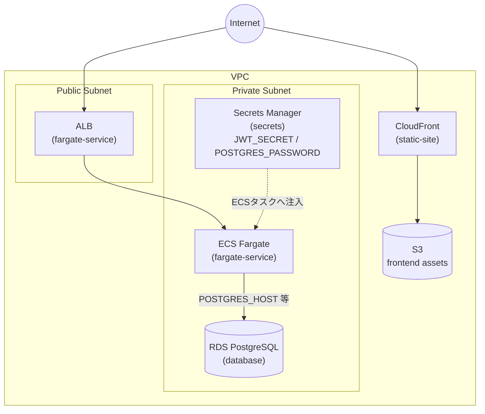
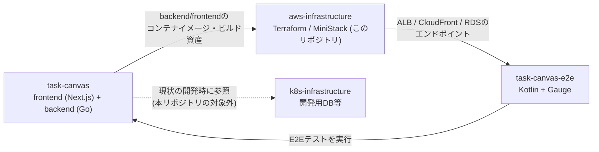

# aws-infrastructure

[task-canvas](https://github.com/kamegoro/task-canvas) のインフラ（Terraform）を、
本番のAWSにお金をかけずにローカルで再現・検証するためのリポジトリです。

[MiniStack](https://github.com/ministackorg/ministack) をDockerで起動し、ローカル環境から
AWS互換APIに対して `terraform apply` できるようにしています。

## このリポジトリの開発の進め方

このリポジトリは[Claude Code](https://claude.com/claude-code)との協働で開発・運用されています。
開発フローやissue/PRの分割方針、コミット・PRの規約は[CLAUDE.md](CLAUDE.md)に、
主要な設計上の意思決定は[docs/adr/](docs/adr/)にまとめています。

## アーキテクチャ

API（ECS Fargate + ALB）とフロントエンド（S3 + CloudFront）を、同一VPC内で
管理する構成を想定しています（`terraform/envs/local`の構成）。



| コンポーネント | モジュール | 役割 |
| --- | --- | --- |
| CloudFront + S3 | `static-site` | フロントエンド（task-canvasのビルド資産）の配信 |
| ALB + ECS Fargate | `fargate-service` | task-canvasのbackend APIの実行（`enable_https`/`acm_certificate_arn`変数でALBのHTTPS(443)リスナーを有効化可能。dev/stg/prod（実AWS）向けで、MiniStackでは未使用） |
| RDS (PostgreSQL) | `database` | task-canvasが利用するデータベース |
| Secrets Manager | `secrets` | `JWT_SECRET`・DBパスワードをECSタスクに注入 |
| VPC / サブネット / SG | `network` | 上記すべてのネットワーク基盤 |

## 関連リポジトリ

task-canvasのアプリケーション本体・E2Eテスト・現状の開発環境とは、
それぞれ以下のように連携しています。



- **task-canvas**: フロントエンド・backendの実装本体。本リポジトリは
  そのコンテナイメージ・ビルド資産を受け取ってAWS互換環境にデプロイする
- **task-canvas-e2e**: 本リポジトリがMiniStack上に構築した環境
  （ALB/CloudFront/RDSのエンドポイント）に対してE2Eテストを実行する
- **k8s-infrastructure**: task-canvasの現状の開発で参照しているDB等の環境。
  本リポジトリが目指すAWS本番相当構成とは別系統

## 構成

```
terraform/
  modules/
    network/         VPC, サブネット, ルートテーブル, セキュリティグループ
    static-site/     S3 + CloudFront (OAC) での静的サイト配信
    fargate-service/ ECS Fargate + ALB でのAPI配信
    database/        RDS (PostgreSQL) でのデータベース
    secrets/         Secrets ManagerでのJWT_SECRET・DB認証情報の管理
  envs/
    local/     上記モジュールをまとめてMiniStack向けにワイヤリング
    dev/       実AWS向け（開発環境）の骨格
    stg/       実AWS向け（ステージング環境）の骨格
    prod/      実AWS向け（本番環境）の骨格
```

`envs/local/providers.tf` には [`tflocal`](https://github.com/localstack/terraform-local)
が生成するようなLocalStack互換のエンドポイントオーバーライドを直接記述しています。
MiniStackはLocalStackと同じエンドポイント形式をエミュレートするため、
`tflocal` コマンドは不要で、通常の `terraform` コマンドのみで動作します。

`envs/dev` / `envs/stg` / `envs/prod` は実AWSに接続するための骨格で、
`providers.tf` は通常の `provider "aws" {}`、`variables.tf` には
環境ごとの命名（`task-canvas-dev` 等）をデフォルト値として設定しています。
認証情報はAWS_PROFILE等の環境変数、もしくはCI/CDのOIDC連携で渡す想定です。

## セットアップ

[mise](https://mise.jdx.dev/) でTerraformのバージョンを管理しています。

```sh
mise install
```

## 使い方

```sh
# MiniStackを起動（ヘルスチェック待ちまで行う）
make up

# terraform/envs/local を初期化してplan/apply
make tf-init
make tf-plan
make tf-apply

# 後片付け
make tf-destroy
make down
```

その他の主なターゲット:

| ターゲット | 内容 |
| --- | --- |
| `make up` / `make down` | MiniStackの起動・停止 |
| `make logs` | MiniStackのログを追跡 |
| `make tf-fmt` | `terraform fmt -recursive` |
| `make tf-validate` | `terraform/envs/local` の `terraform validate` |
| `make tf-output` | `terraform/envs/local` の出力を表示 |

## MiniStackについて

[MiniStack](https://github.com/ministackorg/ministack) はLocalStack互換の
AWSエミュレータで、MITライセンスでサインアップ不要、`network`/`static-site`/`fargate-service`/`database`/`secrets`
すべてのモジュールが利用するサービス（VPC/SG、S3、CloudFront、ECS、ELBv2、RDS、Secrets Manager）を
無料でエミュレートします。ECSタスク・RDSインスタンスはホストのDocker socketを
使って実際のコンテナとして起動されます。

| モジュール | `terraform plan` | `terraform apply` |
| --- | --- | --- |
| `network` | ✅ | ✅ |
| `static-site` | ✅ | ✅ |
| `fargate-service` | ✅ | ✅ |
| `database` | ✅ | ✅ |
| `secrets` | ✅ | ✅ |
| `envs/local`（全体） | ✅ | ✅ |

```sh
cd terraform/envs/local
terraform apply
terraform destroy
```

### 既知の制約: S3 Public Access Blockのdestroy

MiniStack 1.3.63には、`DeletePublicAccessBlock` が成功を返すものの
`GetPublicAccessBlock` が以前の設定を返し続けるバグがあり、
`aws_s3_bucket_public_access_block.frontend` の `terraform destroy` が
タイムアウトします（[ministackorg/ministack#915](https://github.com/ministackorg/ministack/issues/915)）。

destroyする際は、事前にこのリソースをstateから外してください。

```sh
cd terraform/envs/local
terraform state rm module.static_site.aws_s3_bucket_public_access_block.frontend
terraform destroy
```
