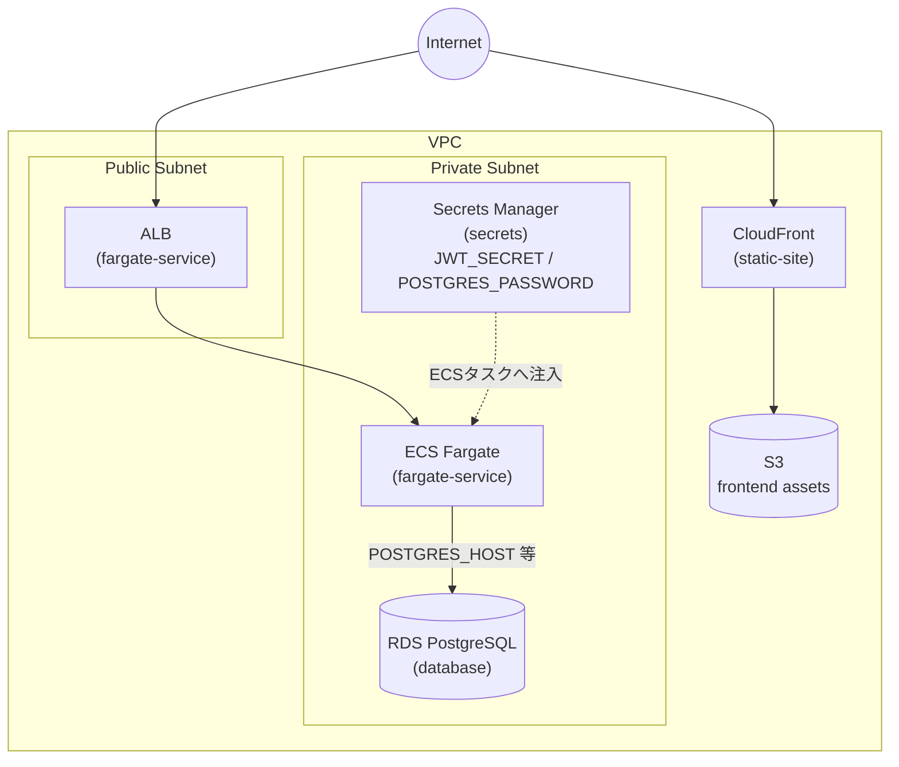
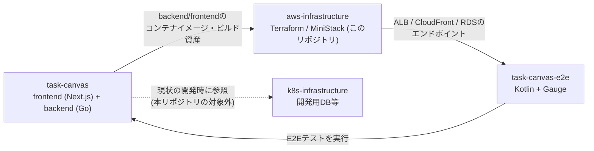

# aws-infrastructure

[task-canvas](https://github.com/kamegoro/task-canvas) のインフラ（Terraform）を、
本番のAWSにお金をかけずにローカルで再現・検証するためのリポジトリです。

[MiniStack](https://github.com/ministackorg/ministack) をDockerで起動し、ローカル環境から
AWS互換APIに対して `terraform apply` できるようにしています。

## このリポジトリの開発の進め方

このリポジトリは[Claude Code](https://claude.com/claude-code)との協働で開発・運用されています。
開発フローやissue/PRの分割方針、コミット・PRの規約は[CLAUDE.md](CLAUDE.md)に、
主要な設計上の意思決定は[docs/adr/](docs/adr/)にまとめています。

## アーキテクチャ

API（ECS Fargate + ALB）とフロントエンド（S3 + CloudFront）を、同一VPC内で
管理する構成を想定しています（`terraform/envs/local`の構成）。



| コンポーネント | モジュール | 役割 |
| --- | --- | --- |
| CloudFront + S3 | `static-site` | フロントエンド（task-canvasのビルド資産）の配信 |
| ALB + ECS Fargate | `fargate-service` | task-canvasのbackend APIの実行（`enable_https`/`acm_certificate_arn`変数でALBのHTTPS(443)リスナーを有効化可能。dev/stg/prod（実AWS）向けで、MiniStackでは未使用） |
| RDS (PostgreSQL) | `database` | task-canvasが利用するデータベース |
| Secrets Manager | `secrets` | `JWT_SECRET`・DBパスワードをECSタスクに注入 |
| VPC / サブネット / SG | `network` | 上記すべてのネットワーク基盤 |

## 関連リポジトリ

task-canvasのアプリケーション本体・E2Eテスト・現状の開発環境とは、
それぞれ以下のように連携しています。



- **task-canvas**: フロントエンド・backendの実装本体。本リポジトリは
  そのコンテナイメージ・ビルド資産を受け取ってAWS互換環境にデプロイする
- **task-canvas-e2e**: 本リポジトリがMiniStack上に構築した環境
  （ALB/CloudFront/RDSのエンドポイント）に対してE2Eテストを実行する
- **k8s-infrastructure**: task-canvasの現状の開発で参照しているDB等の環境。
  本リポジトリが目指すAWS本番相当構成とは別系統

## 構成

```
terraform/
  modules/
    network/         VPC, サブネット, ルートテーブル, セキュリティグループ
    static-site/     S3 + CloudFront (OAC) での静的サイト配信
    fargate-service/ ECS Fargate + ALB でのAPI配信
    database/        RDS (PostgreSQL) でのデータベース
    secrets/         Secrets ManagerでのJWT_SECRET・DB認証情報の管理
    ecr/             task-canvasバックエンドイメージ用のECRリポジトリ
  envs/
    local/     上記モジュールをまとめてMiniStack向けにワイヤリング
    dev/       実AWS向け（開発環境）の骨格
    stg/       実AWS向け（ステージング環境）の骨格
    prod/      実AWS向け（本番環境）の骨格
```

`envs/local/providers.tf` には [`tflocal`](https://github.com/localstack/terraform-local)
が生成するようなLocalStack互換のエンドポイントオーバーライドを直接記述しています。
MiniStackはLocalStackと同じエンドポイント形式をエミュレートするため、
`tflocal` コマンドは不要で、通常の `terraform` コマンドのみで動作します。

`envs/dev` / `envs/stg` / `envs/prod` は実AWSに接続するための骨格で、
`providers.tf` は通常の `provider "aws" {}`、`variables.tf` には
環境ごとの命名（`task-canvas-dev` 等）をデフォルト値として設定しています。
認証情報はAWS_PROFILE等の環境変数、もしくはCI/CDのOIDC連携で渡す想定です。

## セットアップ

以下のツールが前提です。

- [Docker](https://www.docker.com/) / Docker Compose（MiniStackの起動）
- [AWS CLI](https://docs.aws.amazon.com/cli/) （`make sync-frontend`など、MiniStackへの直接アクセス）
- [jq](https://jqlang.org/)（`scripts/tf-outputs-env.sh`）
- [tflint](https://github.com/terraform-linters/tflint) /
  [tfsec](https://github.com/aquasecurity/tfsec)（CIで実行している静的解析をローカルで再現する場合）

Terraformのバージョンは[mise](https://mise.jdx.dev/)で管理しています。

```sh
mise install
```

## 使い方

```sh
# MiniStackを起動（ヘルスチェック待ちまで行う）
make up

# terraform/envs/local を初期化してplan/apply
make tf-init
make tf-plan
make tf-apply

# 後片付け
make tf-destroy
make down
```

その他の主なターゲット:

| ターゲット | 内容 |
| --- | --- |
| `make up` / `make down` | MiniStackの起動・停止 |
| `make logs` | MiniStackのログを追跡 |
| `make tf-fmt` | `terraform fmt -recursive` |
| `make tf-validate` | `terraform/envs/local` の `terraform validate` |
| `make tf-output` | `terraform/envs/local` の出力を表示 |
| `make tflint` | [tflint](https://github.com/terraform-linters/tflint)による静的解析 |
| `make tfsec` | [tfsec](https://github.com/aquasecurity/tfsec)によるセキュリティ面の静的解析 |
| `make sync-frontend FRONTEND_DIR=<dir>` | `<dir>`配下の静的アセットをフロントエンド用S3バケットにアップロード |
| `make e2e [FRONTEND_DIR=<dir>] [E2E_DIR=<dir> E2E_CMD="<cmd>"]` | MiniStack起動からapply・フロントエンド資産sync・E2Eテスト・destroy・停止までを一括実行 |

### apply・E2Eテスト・destroyを1コマンドで実行する

`make e2e`は、MiniStackの起動からterraformの`apply`、（`FRONTEND_DIR`指定時は）
フロントエンド資産のsync、（`E2E_DIR`/`E2E_CMD`指定時は）E2Eテストの実行、
`destroy`、MiniStackの停止までを一括で実行します。E2Eテストの成否に関わらず
最後にdestroy・停止まで行われます。

```sh
make e2e \
  FRONTEND_DIR=path/to/static/assets \
  E2E_DIR=../task-canvas-e2e \
  E2E_CMD="mvn test"
```

`E2E_CMD`は`E2E_DIR`をカレントディレクトリとして実行され、その際に
`terraform/envs/local`の出力（[outputs.tf](terraform/envs/local/outputs.tf)）が
`TF_OUT_<出力名をすべて大文字にしたもの>`という環境変数（例:
`TF_OUT_ALB_DNS_NAME`、`TF_OUT_FRONTEND_BUCKET_NAME`）としてエクスポートされます。
E2Eテスト側でこれらの環境変数を読み込むことで、MiniStackが生成したエンドポイントに
接続できます（変換ロジックは[scripts/tf-outputs-env.sh](scripts/tf-outputs-env.sh)）。

### フロントエンドのビルド資産をS3にアップロードする

`static-site`モジュールはS3バケットとCloudFrontディストリビューションを
作成するのみで、コンテンツのアップロードは行いません。`terraform apply`後に
任意の静的アセットディレクトリを[scripts/sync-frontend.sh](scripts/sync-frontend.sh)で
アップロードできます（バケット名は`terraform output`から取得します）。

```sh
make sync-frontend FRONTEND_DIR=path/to/static/assets
```

> [!NOTE]
> MiniStackのCloudFrontはコントロールプレーン（ディストリビューションの
> 作成・管理API）のみをエミュレートし、ディストリビューションドメイン
> （`*.cloudfront.net`）経由での実際のコンテンツ配信は行いません。
> アップロード結果の確認はS3バケットへの直接アクセスで行ってください。
>
> ```sh
> aws --endpoint-url=http://s3.localhost.localstack.cloud:4566 \
>   s3 ls s3://$(terraform -chdir=terraform/envs/local output -raw frontend_bucket_name)/
> ```

CIでは上記に加えて[tflint](https://github.com/terraform-linters/tflint)
（[.tflint.hcl](.tflint.hcl)、`terraform`プラグインの`recommended`プリセット）による
静的解析を実行しています。ローカルで実行する場合は以下の通りです。

```sh
make tflint
```

また、[tfsec](https://github.com/aquasecurity/tfsec)によるセキュリティ面の
静的解析も実行しています。本番グレードのハードニング項目など、このリポジトリの
目的に合わない検出項目は[.tfsec/config.yml](.tfsec/config.yml)で除外しており、
除外理由は[ADR 0005](docs/adr/0005-tfsec-exclusions.md)にまとめています。
ローカルで実行する場合は以下の通りです。

```sh
make tfsec
```

## MiniStackについて

[MiniStack](https://github.com/ministackorg/ministack) はLocalStack互換の
AWSエミュレータで、MITライセンスでサインアップ不要、`network`/`static-site`/`fargate-service`/`database`/`secrets`/`ecr`
すべてのモジュールが利用するサービス（VPC/SG、S3、CloudFront、ECS、ELBv2、RDS、Secrets Manager、ECR）を
無料でエミュレートします。ECSタスク・RDSインスタンスはホストのDocker socketを
使って実際のコンテナとして起動されます。

| モジュール | `terraform plan` | `terraform apply` |
| --- | --- | --- |
| `network` | ✅ | ✅ |
| `static-site` | ✅ | ✅ |
| `fargate-service` | ✅ | ✅ |
| `database` | ✅ | ✅ |
| `secrets` | ✅ | ✅ |
| `ecr` | ✅ | ✅ |
| `envs/local`（全体） | ✅ | ✅ |

```sh
cd terraform/envs/local
terraform apply
terraform destroy
```

### 既知の制約: S3 Public Access Blockのdestroy

MiniStack 1.3.63には、`DeletePublicAccessBlock` が成功を返すものの
`GetPublicAccessBlock` が以前の設定を返し続けるバグがあり、
`aws_s3_bucket_public_access_block.frontend` の `terraform destroy` が
タイムアウトします（[ministackorg/ministack#915](https://github.com/ministackorg/ministack/issues/915)）。

`make tf-destroy`/`make e2e`はこの回避策を組み込んでいるため、
そのまま実行すればタイムアウトしません。`terraform`コマンドを直接使う場合は、
事前にこのリソースをstateから外してください。

```sh
cd terraform/envs/local
terraform state rm module.static_site.aws_s3_bucket_public_access_block.frontend
terraform destroy
```
